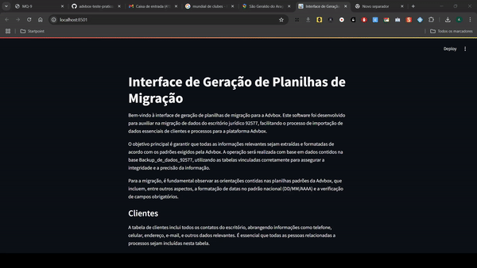

# Advbox teste prático

## Descrição dos Arquivos e Pastas

### `data/backup/`
- **Função**: Pasta onde os arquivos de backup gerados são armazenados. Essa é a saída do processo de transformação e carga, contendo os arquivos `CLIENTES.xlsx` e `PROCESSOS.xlsx`.

### `img/interface.gif`
- **Função**: Imagem em formato GIF que mostra uma demonstração da interface do usuário do aplicativo, permitindo que os usuários visualizem como a interface funciona.

### `app.py`
- **Função**: Arquivo principal para executar a interface do projeto usando Streamlit. Ele permite a interação com o usuário para gerar os arquivos de migração de dados (CLIENTES.xlsx e PROCESSOS.xlsx).

### `extract.py`
- **Função**: Script responsável pela extração de dados dos arquivos de backup. Ele coleta as informações necessárias para o processamento.

### `transform.py`
- **Função**: Contém as funções `transformacao_clientes` e `transformacao_processos`, que realizam a transformação e carga dos dados extraídos, gerando os arquivos finais `CLIENTES.xlsx` e `PROCESSOS.xlsx`.

### `notes.txt`
- **Função**: Arquivo de anotações usado para registrar informações importantes, decisões e observações feitas durante o desenvolvimento do projeto.

### `README.md`
- **Função**: Documento que contém a descrição do projeto, instruções de uso e informações sobre a estrutura dos arquivos.

### `LICENSE`
- **Função**: Arquivo que especifica a licença sob a qual o projeto está distribuído.

### `.gitignore`
- **Função**: Arquivo de configuração para o Git, usado para ignorar arquivos e pastas específicas que não devem ser rastreadas pelo sistema de controle de versão.

## Como Usar o Projeto

1. **Preparação**:
   - Certifique-se de ter o Python 3.x instalado em sua máquina.
   - Instale as dependências necessárias usando `pip install -r requirements.txt` (crie um `requirements.txt` com as bibliotecas usadas, como `streamlit`, `pandas`, etc.).

2. **Executando a Interface**:
   - Navegue até o diretório do projeto.
   - Execute o comando `streamlit run app.py` para iniciar a interface do usuário no navegador.

3. **Gerando Arquivos de Migração**:
   - Na interface do Streamlit, clique nos botões "Gerar CLIENTES.xlsx" e "Gerar PROCESSOS.xlsx" para iniciar o processo de transformação e salvar os arquivos na pasta `data/backup/`.

## Licença

Este projeto está licenciado sob a [MIT License](LICENSE). 
